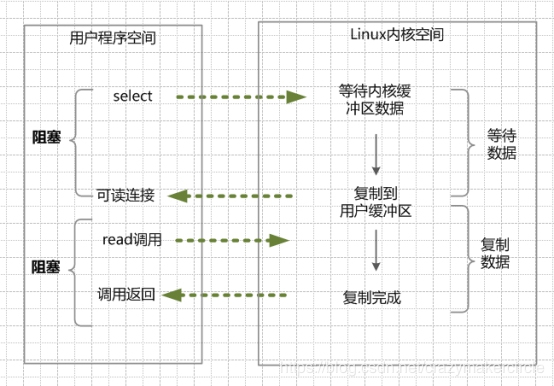

##Socket通信

### 建立通信链路

- 客户端首先要创建一个Socket实例，在这个实例的构造函数返回之前，将要进行TCP的三次握手协议，握手协议完成后，socket实例才被创建成功

- 服务端需要创建一个ServerSocket实例，默认监听所有地址与端口，然后调用accept方法进入阻塞状态，当有客户端请求时，则会创建一个套接字数据结构
并放入ServerSocket的未完成连接数据结构列表，注意，此时连接并未建立，需要等到Socket返回正确的构造函数，也就是TCP的三次握手正确进行后，才会
将这个连接放入已完成连接数据结构列表，所有，这些数据结构列表中每一个实例都是一个客户端建立的TCP连接


### 数据传输

- 大概思路是当连接建立成功后，服务端和客户端都会有一个Socket对象，每一个对象又有一对InputStream和OutputStream对象，操作系统会为每一个
对象分配足够的缓存区内存。数据发送方通过OutputStream将数据发送到其对应的队列中，数据接收方通过InputStream接收数据到对应的队列中

## NIO

- Channel对象作为NIO的通信信道，将信道绑定到IO对象上

- Selector对象作为NIO的选择器，可以同时监听一组通信信道，如果没有一个信道的状态发生变化，则会返回0，如果多个信道有数据，则会通过Selector
将数据分配到每个信道指定的Buffer中，在这里关键的地方就是，有一个线程来处理所有连接的数据交互，每个连接的数据交互方式都不是阻塞方式，所以可以
处理大量的连接请求

- Buffer对象作为NIO的数据缓冲区，可以用来存放信道传来的数据。注意，在创建Buffer对象后，需要申请内存，这里申请的内存并不是JAVA堆上的内存,
而是直接内存。这样就避免的内存在操作系统和JVM上互相复制造成的消耗


## 例子解析

 一个服务端的BIO例子，监听本机8080端口 并打印接收到的数据。
````java

byte[] buffer = new byte[1024];

        try {
            ServerSocket serverSocket = new ServerSocket();
            serverSocket.bind(new InetSocketAddress("127.0.0.1",8080));

            while(true) {
                Socket accept = serverSocket.accept();
                System.out.println(new String("连接成功".getBytes("gbk"),"utf-8"));
                int read = accept.getInputStream().read(buffer);
                System.out.println(new String(buffer));
            }
        } catch (IOException e) {
            e.printStackTrace();
        }


````

一个BIO的客户端例子，用来向本机8080端口发送数据

````java

Socket socket = new Socket("127.0.0.1",8080);

        Scanner sc = new Scanner(System.in);
        String next = sc.next();

        socket.getOutputStream().write(next.getBytes());

        socket.close();

````


这里我们可以发现，由于BIO为阻塞IO，当服务端程序获取连接以及获取客户端的数据时，都会将自己阻塞，那么问题就来了。

- 假设我们拥有两个客户端，第一个客户端建立连接后并没有发送数据，那么就会阻塞在read方法中。此时第二个客户端无法建立连接。

- 假设我们拥有两个客户端，两个都已经建立连接且发送过数据，此时服务端就会阻塞在accept方法中.客户端1再发送数据服务端无法接到。

解决方案

- 问题1 我们可以创建线程去完成read方法，而不是在主方法中去read，但是这样就变成多线程问题，会创建非常多的线程

- 问题2 可以维护一个Socket列表 ，每次都在线程中遍历这个列表，从每个Socket中获取数据


这里，我们可以发现如果使用BIO去解决服务端客户端的问题，就必须使用多线程来解决，而问题的关键就出现在2个阻塞上，所以，就有了NIO，通过单线程的方式
去解决服务端客户端问题


````java

package lyw.aop;

import java.io.IOException;
import java.net.InetSocketAddress;
import java.nio.ByteBuffer;
import java.nio.channels.ServerSocketChannel;
import java.nio.channels.SocketChannel;
import java.util.ArrayList;
import java.util.List;

public class QQServerNIO {


    public static void main(String[] args) throws IOException, InterruptedException {

        ByteBuffer byteBuffer = ByteBuffer.allocate(1024);

        List<SocketChannel> socketChannelList = new ArrayList<>();

        ServerSocketChannel serverSocketChannel = ServerSocketChannel.open();

        serverSocketChannel.bind(new InetSocketAddress("127.0.0.1",8080));

        //设置为非阻塞
        serverSocketChannel.configureBlocking(false);

        while(true){

            Thread.sleep(1000);

            //此时accept方法不会阻塞
            final SocketChannel accept = serverSocketChannel.accept();


            //采用轮询的方法去遍历SocketChannel列表 如果缓冲区有数据，那么就读出它
            for(SocketChannel channel : socketChannelList){
                final int read = channel.read(byteBuffer);
                System.out.println(read);
                if(read > 0){
                    System.out.println("==========conn have data========");
                    System.out.println(byteBuffer.toString());
                }else{
                    System.out.println("==========conn no data=========");
                }
            }

            if(accept != null){
                //设置为非阻塞
                accept.configureBlocking(false);
                System.out.println("=========one conn=========");
                socketChannelList.add(accept);
            }else{
                System.out.println("========wait conn=========");
            }


        }
    }
}


````


此时，我们发现在这种情况下，资源利用的效率极低，由于都是非阻塞状态，且一直进行轮询，性能是十分之差的。此时就出现了Selector对象来解决
这个问题


````java
package lyw.aop;

import java.io.IOException;
import java.net.InetSocketAddress;
import java.nio.ByteBuffer;
import java.nio.channels.SelectionKey;
import java.nio.channels.Selector;
import java.nio.channels.ServerSocketChannel;
import java.nio.channels.SocketChannel;
import java.util.Iterator;

public class QQServerNIO {


    public static void main(String[] args) throws IOException{

        ByteBuffer byteBuffer = ByteBuffer.allocate(1024);


        ServerSocketChannel serverSocketChannel = ServerSocketChannel.open();

        serverSocketChannel.bind(new InetSocketAddress("127.0.0.1", 8080));

        serverSocketChannel.configureBlocking(false);

        //打开一个选择器
        Selector selector = Selector.open();
        //将信道绑定在选择器上 ，并指定感兴趣的事件为接收连接
        serverSocketChannel.register(selector, SelectionKey.OP_ACCEPT);

        while (true) {

            //调用linux的epoll函数 或是 其他系统的select函数 获取所有触发事件的信道 此方法为阻塞方法
            selector.select();

            System.out.println("---------------");

            Iterator<SelectionKey> iterator = selector.selectedKeys().iterator();

            while (iterator.hasNext()) {

                SelectionKey selectionKey = iterator.next();
                iterator.remove();

                if (selectionKey.isAcceptable()) {

                    ServerSocketChannel serverSocketChannel1 = (ServerSocketChannel) selectionKey.channel();

                    SocketChannel socketChannel = serverSocketChannel1.accept();

                    //这里必须设置为非阻塞 否则无法注册
                    socketChannel.configureBlocking(false);

                    socketChannel.register(selector, SelectionKey.OP_READ);

                    System.out.println("connect one");

                    //如果为读事件
                } else if (selectionKey.isReadable()) {

                    SocketChannel socketChannel = (SocketChannel) selectionKey.channel();

                    try {
                        //注意 如果这里客户端关闭，会进入到read事件中 ，但此时信道已无法读取，所以在异常中关闭此信道，回收资源
                        socketChannel.read(byteBuffer);
                    } catch (IOException e) {
                        socketChannel.close();
                        System.out.println("conn closed");
                    }
                    byteBuffer.flip();
                    System.out.println(new String(byteBuffer.array()));
                }
            }
        }
    }
}


````


### JAVA NIO底层原理

如何避免同步非阻塞NIO模型中轮询等待的问题呢？这就是IO多路复用模型。

IO多路复用模型，就是通过一种新的系统调用，一个进程可以监视多个文件描述符，一旦某个描述符就绪（一般是内核缓冲区可读/可写），内核kernel能够通知程序进行相应的IO系统调用。

目前支持IO多路复用的系统调用，有 select，epoll等等。select系统调用，是目前几乎在所有的操作系统上都有支持，具有良好跨平台特性。epoll是在linux 2.6内核中提出的，是select系统调用的linux增强版本。

IO多路复用模型的基本原理就是select/epoll系统调用，单个线程不断的轮询select/epoll系统调用所负责的成百上千的socket连接，当某个或者某些socket网络连接有数据到达了，就返回这些可以读写的连接。因此，好处也就显而易见了——通过一次select/epoll系统调用，就查询到到可以读写的一个甚至是成百上千的网络连接。

举个栗子。发起一个多路复用IO的的read读操作系统调用，流程是这个样子：

 


在这种模式中，首先不是进行read系统调动，而是进行select/epoll系统调用。当然，这里有一个前提，需要将目标网络连接，提前注册到select/epoll的可查询socket列表中。然后，才可以开启整个的IO多路复用模型的读流程。

（1）进行select/epoll系统调用，查询可以读的连接。kernel会查询所有select的可查询socket列表，当任何一个socket中的数据准备好了，select就会返回。

当用户进程调用了select，那么整个线程会被block（阻塞掉）。

（2）用户线程获得了目标连接后，发起read系统调用，用户线程阻塞。内核开始复制数据。它就会将数据从kernel内核缓冲区，拷贝到用户缓冲区（用户内存），然后kernel返回结果。

（3）用户线程才解除block的状态，用户线程终于真正读取到数据，继续执行。

多路复用IO的特点：

IO多路复用模型，建立在操作系统kernel内核能够提供的多路分离系统调用select/epoll基础之上的。多路复用IO需要用到两个系统调用（system call）， 一个select/epoll查询调用，一个是IO的读取调用。

和NIO模型相似，多路复用IO需要轮询。负责select/epoll查询调用的线程，需要不断的进行select/epoll轮询，查找出可以进行IO操作的连接。

另外，多路复用IO模型与前面的NIO模型，是有关系的。对于每一个可以查询的socket，一般都设置成为non-blocking模型。只是这一点，对于用户程序是透明的（不感知）。

多路复用IO的优点：

用select/epoll的优势在于，它可以同时处理成千上万个连接（connection）。与一条线程维护一个连接相比，I/O多路复用技术的最大优势是：系统不必创建线程，也不必维护这些线程，从而大大减小了系统的开销。

Java的NIO（new IO）技术，使用的就是IO多路复用模型。在linux系统上，使用的是epoll系统调用。

多路复用IO的缺点：

本质上，select/epoll系统调用，属于同步IO，也是阻塞IO。都需要在读写事件就绪后，自己负责进行读写，也就是说这个读写过程是阻塞的。

如何充分的解除线程的阻塞呢？那就是异步IO模型。
