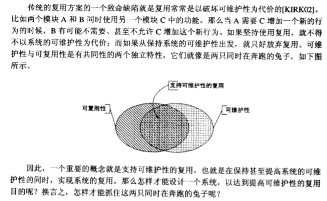
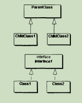
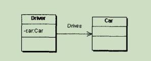
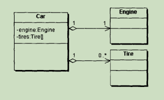
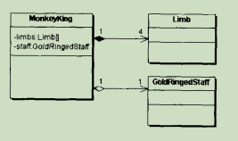
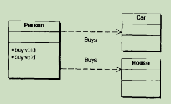
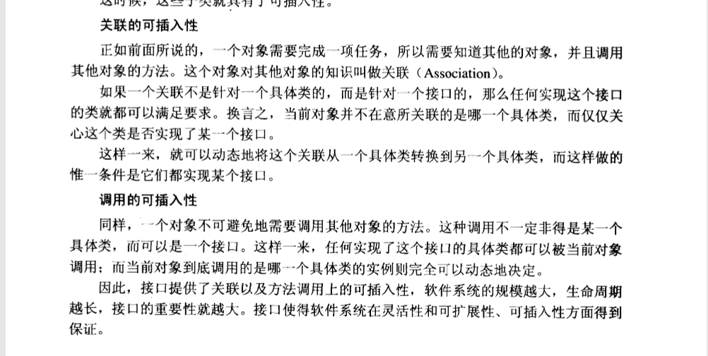
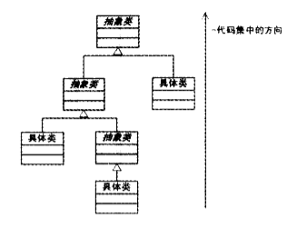
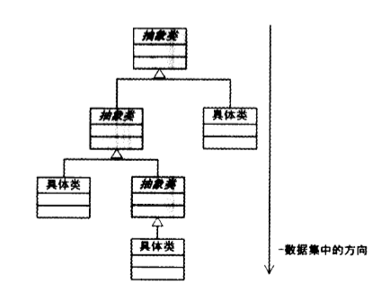

##学习笔记

如何做到支持可维护性的复用？

### UML

类图中各类与类之间的关系

- 一般化关系 表示类与类之间继承或实现的关系 是从子类指向父类的

     
     
- 关联关系 表示类与类之间的连接，他使一个类知道另一个类的属性和方法

    
    
- 聚合关系 同样也表示类与类之间的连接，不过与关联不同的是，聚合的两个类并不在同一个层次上，一个代表整体，一个代表部分
    
    
    
- 合成关系 也表示类与类之间的连接，不过关联性比聚合更强，表现在负责整体的类要控制代表部分的类的生命周期。

    
    
- 依赖关系 表示一个类依赖于另一个类的定义，与关联关系不同的是，依赖关系的两个类里并不需要定义另一个类的属性，而是在方法中传入

    

### 设计原则

- 开闭原则（ocp) ： 对扩展开放，对修改关闭。 实现的关键在于抽象化
- 里氏替换原则 ： 任何基类出现的地方，都可以用子类来替换
- 依赖倒转原则 ： 要依赖于抽象 而不是依赖于实现
- 接口隔离原则 ： 要尽可能提供较小的接口，而不是提供大的接口
- 合成/聚合复用原则 ： 要尽量使用合成/聚合复用代码，而不使用继承
- 迪米特原则 : 一个对象应对另一个对象有尽可能少的了解 这里理解为 MVC架构中不会跨层引用,控制层只会引用业务层,而不会引用持久层，
也可以通过工厂模式来理解此原则，把具体实现细节写在工厂方法中，只暴露工厂给使用者，是系统内部耦合度降低

#### 依赖倒转原则

 一. 类与类之间三种依赖关系
 
 1.零耦合关系，类与类之间没有任何关联
 
 2.具体耦合关系，由一个类对另一个具体类的直接引用造成
 
 3.抽象耦合关系，由一个类对另一个抽象类（或接口）的引用，可以是关联，也可以是依赖
 
 二. 针对接口编程指的是要在接口和实现类中实现对变量，参量等的声明。也就是说，在具体实现类中，应只有对接口和抽象类的实现方法，而不应该包含其他方法。
 可以发现的是，java在创建对象时，并不满足依赖倒转原则，因为必须要显示声明创建对象的类型。正因为如此，出现了工厂等设计模式

#### 迪米特原则

 一. 将迪米特原则应用到系统中应注意一下几点
 
 1.在类的划分上，应尽量设计弱耦合的类
 
 2.在类的结构设计上，每一个类都应该降低成员的访问权限
 
 3.只要有可能，应尽量将类设计成不变类（对象的内部状态无法改变，没有属性赋值方法）
 
 4.对其他类引用时，应将对对象的引用降到最低

### 接口

#### 接口对可插入性的保证

### 抽象类

设计类结构时应尽量保证所有的继承都是从抽象类开始的，而所有的具体类都没有子类

#### 设计理念
应尽量将公共代码抽取到上层

应尽量将数据移动到下层

#### 何时使用继承复用

- 如果两个类之间是“is a”关系，那么就使用继承。如果两个类之间是“has a”关系，则使用聚合关系描述。is a关系是指子类是超类的一种特殊种类，比如金丝猴和猴子。
has a关系是指子类是超类的一种角色，比如爬树和猴子

- 永远不要出现需要将一个子类换成另一个类的子类的情况。

- 子类应该具有扩展超类的责任，而不是去覆盖或者注销掉方法

- 不要继承工具类

## 创建模式

### 简单工厂模式

定义：由一个工厂类根据传入的参量决定创建出哪一种产品类的实例

### 工厂方法模式

定义：定义一个创建产品对象的工厂接口，将创建实际工作推迟到子类中

 一. 简单工厂模式的缺点

 对开-闭原则的支持不够，在新增产品对象时，虽然客户端不需要做出改变，但却需要在工厂对象中增加代码

