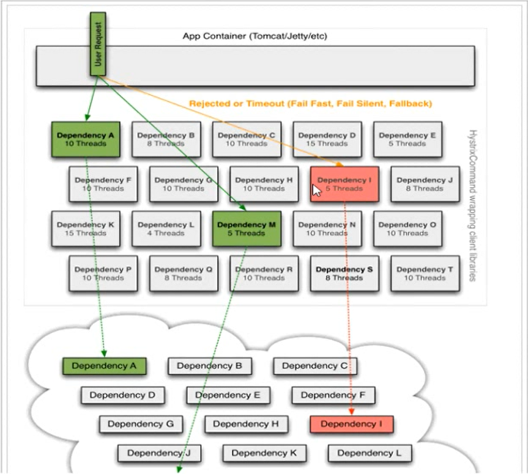

## SpringCloud

###Hystrix

#### 线程隔离示意图

 

我们知道服务器的连接是有限的，当一个连接在访问时被阻塞，如果不做有效的处理，会使所有的连接都被阻塞在这里，进而导致服务器无连接可用，为了解决
这个问题，hystrix有了线程隔离这个机制，为每个服务分配一个线程池，一个服务只能有固定的线程执行，这样就不会造成服务器无连接可用的问题。

线程数 = 每秒请求数 * 响应时长(单位s) + (缓冲线程数)

####服务降级

当一个服务的线程池被占满，无法使用，或是请求超时时，服务调用者如果再去调用此服务，服务将会被降级，即只进行基层服务，比如返回一个错误

####断路器

hystrix还有一种机制用来解决雪崩效应，断路器机制分为3个状态，闭路状态，开路状态，半开路状态

- 闭路状态 正常的服务状态 
- 开路状态 默认情况下，请求该服务失败数量超过50% 便会进入到开路状态 在开路状态下，该服务会快速失败，直接返回降级信息
- 半开路状态 默认情况下，开路状态下5秒后进入半开路状态，会判断下一次请求是否有问题，如果没有问题，切换到闭路状态，否则切换到开路状态

### Ribborn

- 如果hystrix.command.default.execution.timeout.enabled为true,则会有两个执行方法超时的配置,一个就是ribbon的ReadTimeout,一个就是熔断器hystrix的timeoutInMilliseconds, 此时谁的值小谁生效
- 如果hystrix.command.default.execution.timeout.enabled为false,则熔断器不进行超时熔断,而是根据ribbon的ReadTimeout抛出的异常而熔断,也就是取决于ribbon
- ribbon的ConnectTimeout,配置的是请求服务的超时时间,除非服务找不到,或者网络原因,这个时间才会生效
- ribbon还有MaxAutoRetries对当前实例的重试次数,MaxAutoRetriesNextServer对切换实例的重试次数, 如果ribbon的ReadTimeout超时,或者ConnectTimeout连接超时,会进行重试操作
- 由于ribbon的重试机制,通常熔断的超时时间需要配置的比ReadTimeout长,ReadTimeout比ConnectTimeout长,否则还未重试,就熔断了
- 为了确保重试机制的正常运作,理论上（以实际情况为准）建议hystrix的超时时间为:(1 + MaxAutoRetries + MaxAutoRetriesNextServer) * ReadTimeout