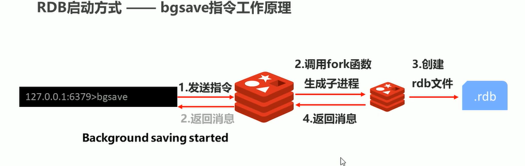
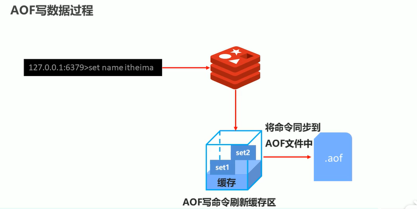

## redis 高级

### 持久化

- RDB 快照方式持久化 每隔一段时间就会将当前数据保存在.rdb文件中 
  - 可用save指令手动保存 但save指令会阻塞redis服务器
  - 用bgSave指令保存 此指令是后台保存方案 原理是调用linux的fork函数创建一个子进程 不会阻塞
  - 可在redis启动文件中配置 自动save 根据key的改变频度来指定save的频度
  
 

- AOF 把写操作记录到AOF文件中，重启后执行AOF文件的所有命令
  - 同步策略可分为 always，everysec，no（系统控制）每秒同步
  - AOF重写机制 可有效减少aof文件的大小 通过在配置文件中配置可开启自动重写 配置策略有两种
    - 最小值重写 当前缓冲区的写操作大于指定的最小值 那么就进行重写
    - 增量值重写 当缓冲区的增量大于设置的百分比时，进行重写
    
 
    
如果要做灾难恢复 那么用RDB最好 如果不允许数据消失，那么就用AOF，可以两者一起使用
  
配置文件

````java

port 6379
logfile "6379.log"
dir /data
dbfilename dump.rdb //开启rdb持久化
save 10 2
appendonly yes //开启aof持久化
appendfsync everysec // 配置策略为每秒一次
appendfilename appendonly-6379.aof

````

### redis 事务

通过multi指令开启事务 exec指令执行事务 discard指令回滚事务

#### 事务原理
   在multi指令后会创建一个队列 把之后所有的命令加入这个队列中，待到exec指令时执行队列中所有的指令，或是discard指令时删除这个队列
   
### redis锁

通过watch指令加锁，unwatch指令解锁

#### 基于锁的事务执行

   对key加锁，在事务提交之间 如果 其他线程对key进行写操作 那么事务就会终止

#### 分布式锁

通过setNX指令 为某一数据加锁，当前只有能够获取锁的线程能够对其进行操作。通过设定锁的有效时长来解决死锁的问题 加锁格式为lock-key

分布式锁加锁代码

````java

Boolean aBoolean = (Boolean) redisTemplate.execute((RedisCallback<Boolean>) connection -> {
            long time = System.currentTimeMillis() + 100;
            Boolean aBoolean1 = connection.setNX("lock-name".getBytes(),String.valueOf(time).getBytes());

            if(aBoolean1) return true;
            else{
                byte[] bytes = connection.get("lock-name".getBytes());
                if(bytes != null && bytes.length > 0){
                    long l = Long.valueOf(new String(bytes));
                    if(l < System.currentTimeMillis()){
                        byte[] bytes1 = connection.getSet("lock-name".getBytes(),String.valueOf(System.currentTimeMillis() + 100).getBytes());
                        //防止其他线程也正在修改锁 故而在此再做判断
                        return Long.valueOf(new String(bytes1)) < System.currentTimeMillis();
                    }
                }

                return false;
            }
        });

````  
 
 
### 删除策略

- 定时删除
- 惰性删除
- 定期删除
- 逐出算法 当新增的数据大小大于redis所剩的内存大小，redis就会逐出一些已经存在的数据
    - 检查易失数据 也就是可能会过期的数据 有很多种策略，最好删除最近最少使用的数据
    
### 主从复制

通过配置文件中 配置 slaveof ip port 的方式 

#### 1.建立连接


#### 2.数据同步

 

#### 3.命令传播

其实就是部分复制 

复制缓冲区的作用就是主服务器每次的写命令都要放入一个队列中，如果有一条传播路径出现问题，可以通过队列来恢复从服务器未接收到的数据
进而实现从服务器之间的数据统一


每个slave 和 master都要保存一个偏移量来记录slave在复制缓冲区的传播位置


应尽量避免全量复制 

- 修改复制缓冲区大小


### 哨兵


#### 工作原理

- 监控阶段


- 通知阶段


- 故障转移阶段

    - 哨兵向slave发送消息用来确认master是否存活 如果没有响应就持续发送 接着把它标记为主观下线状态
    - 哨兵接着像其它的哨兵发送消息表示该master下线了 其他哨兵像此master发送消息确认其是否下线，如果有一半的哨兵确认其下线，那么
    把其标记为客观下线状态
    - 哨兵之间进行选举，选出一个进行找新master的哨兵
    - 找新master的规则
        - 淘汰不在线的
        - 淘汰响应慢的
        - 淘汰与原master连接少的
    - 选举出后 让其他的slave连接新的master 并让原master变成slave等到恢复后重新连接