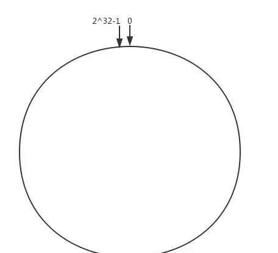
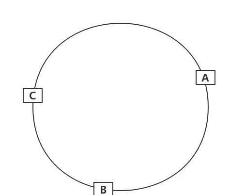
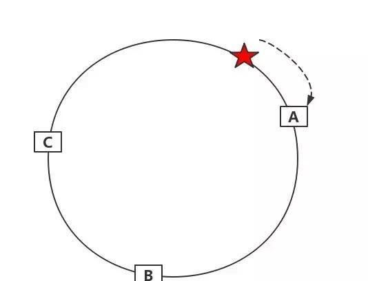
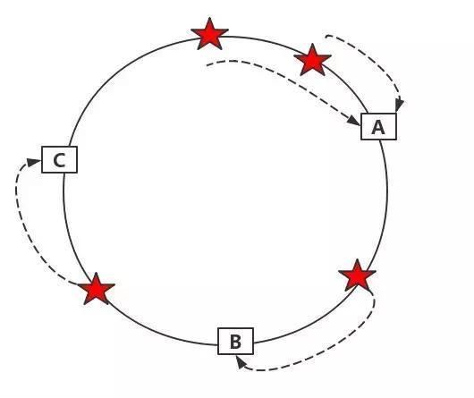
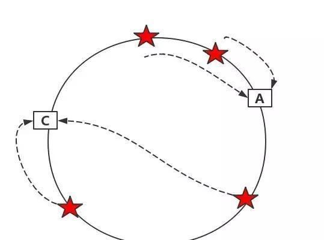
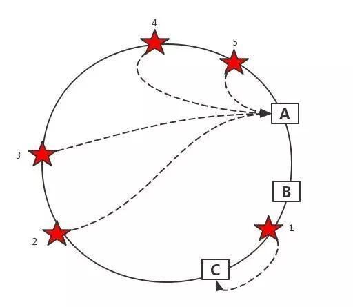
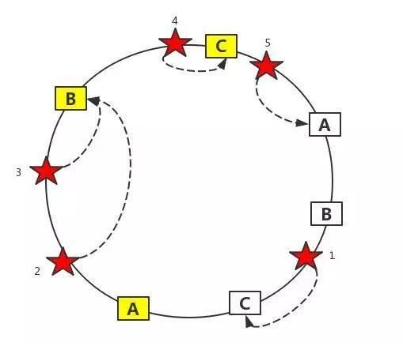

一致性哈希算法的精髓只有一个:对2^32次方取模。

我们将二的三十二次方想象成一个圆，这个圆上的数字就是即0~-1。

如下图所示

 
 
 
这时候有三台缓存服务器A、B、C。

我们hash % 2^32
插播一下，写到这里，这里我又想起一道题了！
有哪些常见的hash算法啊？

OK，先继续我们的话题。经过上面的运算，我们算出的结果一定是一个0到2^32-1之间的一个整数，我们就用算出的这个整数，代表服务器A，既然这个整数肯定处于0到2^32-1之间，那么，上图中的hash环上必定有一个点与这个整数对应，我们使用这个整数代表服务器A，那么，服务器A就可以映射到这个环上。
同理进行
hash % 2^32
hash % 2^32
于是，得到了下面这一张图

 
 
那么，我们要用服务器存储session，那么我们用sessionId做key，进行如下运算
hash % 2^32
得到的一个环上的值。那我们怎么知道session被存到哪个服务器上呢，OK，顺时针方向找到的第一个服务器就是。如下图所示
 
 

假设，我们现在有四个session，分别进行映射运算后得到如下的环

 

这么做的好处？
使用一致性算法后，当服务器B移除的时候，服务器B上的数据会顺时针移动到服务器C上去。从而避免了当服务器数量发生改变当时候，所有的session都失效。
如下所示

  

虚拟槽的应用？
真实世界中，服务器可能映射的并不均匀。这就导致了数据可能是下面这样的，大量的数据在A服务器上，导致数据不均匀
 
  

为了解决这个问题，我们给A、B、C三台服务器引入虚拟节点。如下图所示
 
  

如图所示，2号session和3号session映射到了虚拟B节点，就会存储到真实的B节点上。通过引入虚拟节点的方式，实现数据的均匀分配！