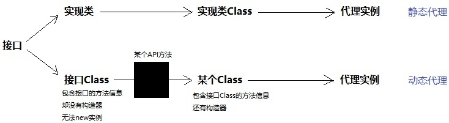
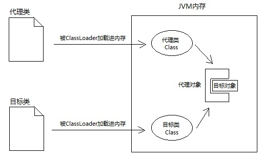
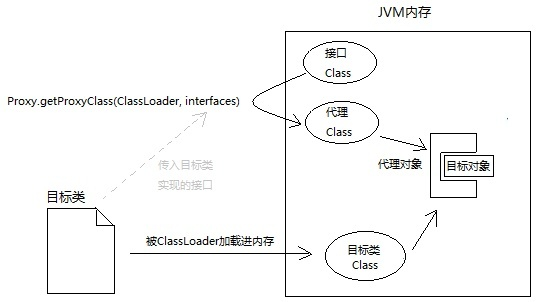
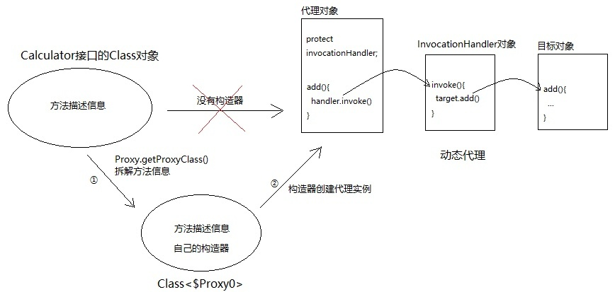

## 动态代理

### 静态代理与动态代理的区别


静态代理



动态代理



### 源码分析

####Proxy类

````java
//通过类加载器和接口Class对象 返回一个代理类的Class
 @CallerSensitive
    public static Class<?> getProxyClass(ClassLoader loader,
                                         Class<?>... interfaces)
        throws IllegalArgumentException
    {
        final Class<?>[] intfs = interfaces.clone();
        final SecurityManager sm = System.getSecurityManager();
        if (sm != null) {
            checkProxyAccess(Reflection.getCallerClass(), loader, intfs);
        }

        return getProxyClass0(loader, intfs);
    }

````


通过这个方法创建代理对象

````java

public static Object newProxyInstance(ClassLoader loader,
                                          Class<?>[] interfaces,
                                          InvocationHandler h)
        throws IllegalArgumentException
    {
        Objects.requireNonNull(h);

        final Class<?>[] intfs = interfaces.clone();
        final SecurityManager sm = System.getSecurityManager();
        if (sm != null) {
            checkProxyAccess(Reflection.getCallerClass(), loader, intfs);
        }

        /*
         * Look up or generate the designated proxy class.
         */
        Class<?> cl = getProxyClass0(loader, intfs);

        /*
         * Invoke its constructor with the designated invocation handler.
         */
        try {
            if (sm != null) {
                checkNewProxyPermission(Reflection.getCallerClass(), cl);
            }

            final Constructor<?> cons = cl.getConstructor(constructorParams);
            final InvocationHandler ih = h;
            if (!Modifier.isPublic(cl.getModifiers())) {
                AccessController.doPrivileged(new PrivilegedAction<Void>() {
                    public Void run() {
                        cons.setAccessible(true);
                        return null;
                    }
                });
            }
            return cons.newInstance(new Object[]{h});
        } catch (IllegalAccessException|InstantiationException e) {
            throw new InternalError(e.toString(), e);
        } catch (InvocationTargetException e) {
            Throwable t = e.getCause();
            if (t instanceof RuntimeException) {
                throw (RuntimeException) t;
            } else {
                throw new InternalError(t.toString(), t);
            }
        } catch (NoSuchMethodException e) {
            throw new InternalError(e.toString(), e);
        }
    }

````

#### InvocationHandler（代理对象每次调用方法都会调用这个类的invoke方法）

````java
//第一个参数 代理对象
//第二个参数 调用的方法
//第三个参数 调用的方法的参数
public Object invoke(Object proxy, Method method, Object[] args)调用的方法的参数
        throws Throwable;

````
这里注意 method.invoke时，内部的参数指的是调用对象，这个对象并不是代理对象，所以不能使用proxy


### 动态代理流程

