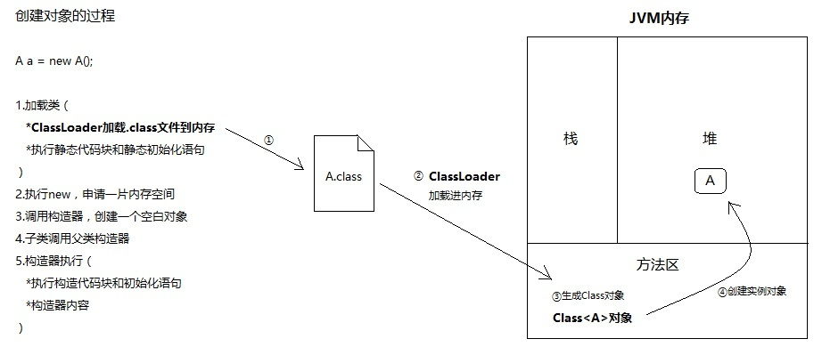

#反射

## Class类源码分析

````java
//Class类中对反射的支持 包含各种变量，方法和构造器等
private static class ReflectionData<T> {
        volatile Field[] declaredFields;
        volatile Field[] publicFields;
        volatile Method[] declaredMethods;
        volatile Method[] publicMethods;
        volatile Constructor<T>[] declaredConstructors;
        volatile Constructor<T>[] publicConstructors;
        // Intermediate results for getFields and getMethods
        volatile Field[] declaredPublicFields;
        volatile Method[] declaredPublicMethods;
        volatile Class<?>[] interfaces;

        // Value of classRedefinedCount when we created this ReflectionData instance
        final int redefinedCount;

        ReflectionData(int redefinedCount) {
            this.redefinedCount = redefinedCount;
        }
    }


````

### Class.forName()

````java

@CallerSensitive
    public static Class<?> forName(String className)
                throws ClassNotFoundException {
        Class<?> caller = Reflection.getCallerClass();
        return forName0(className, true, ClassLoader.getClassLoader(caller), caller);
    }

````
实际上还是用过类加载器去得到Class对象

### Class.newInstance()

````java
public T newInstance()
        throws InstantiationException, IllegalAccessException
    {
        if (System.getSecurityManager() != null) {
            checkMemberAccess(Member.PUBLIC, Reflection.getCallerClass(), false);
        }

        // NOTE: the following code may not be strictly correct under
        // the current Java memory model.

        // Constructor lookup
        if (cachedConstructor == null) {
            if (this == Class.class) {
                throw new IllegalAccessException(
                    "Can not call newInstance() on the Class for java.lang.Class"
                );
            }
            try {
                Class<?>[] empty = {};
                //得到的是无参构造器
                final Constructor<T> c = getConstructor0(empty, Member.DECLARED);
                // Disable accessibility checks on the constructor
                // since we have to do the security check here anyway
                // (the stack depth is wrong for the Constructor's
                // security check to work)
                java.security.AccessController.doPrivileged(
                    new java.security.PrivilegedAction<Void>() {
                        public Void run() {
                                c.setAccessible(true);
                                return null;
                            }
                        });
                cachedConstructor = c;
            } catch (NoSuchMethodException e) {
                throw (InstantiationException)
                    new InstantiationException(getName()).initCause(e);
            }
        }
        Constructor<T> tmpConstructor = cachedConstructor;
        // Security check (same as in java.lang.reflect.Constructor)
        int modifiers = tmpConstructor.getModifiers();
        if (!Reflection.quickCheckMemberAccess(this, modifiers)) {
            Class<?> caller = Reflection.getCallerClass();
            if (newInstanceCallerCache != caller) {
                Reflection.ensureMemberAccess(caller, this, null, modifiers);
                newInstanceCallerCache = caller;
            }
        }
        // Run constructor
        try {
            //通过无参构造器去构建实例
            return tmpConstructor.newInstance((Object[])null);
        } catch (InvocationTargetException e) {
            Unsafe.getUnsafe().throwException(e.getTargetException());
            // Not reached
            return null;
        }
    }


````

反射是对存在于方法区的class对象 

