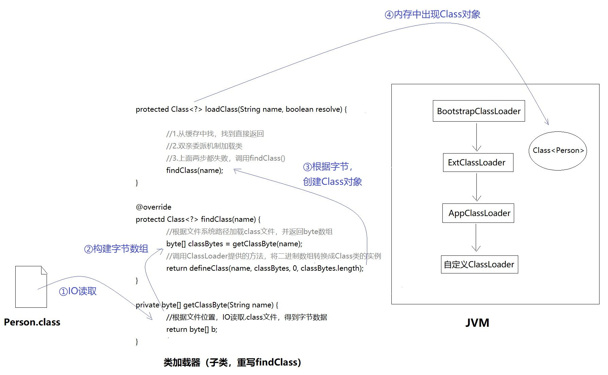

##  类加载的时机

类加载整个生命周期包括 

- 加载
- 连接
    - 验证
    - 准备
    - 解析
- 初始化
- 使用
- 卸载

### 加载

1. 通过一个类的全限定名来获取定义此类的二进制字节流(可通过zip包读取，运行时计算生成等)
2. 将这个字节流所代表的静态存储机构转化为方法区的运行时数据结构
3. 在内存中生成一个代表这个类的java.lang.Class对象，作为方法区这个类的各种数据的访问入口

### 验证

目的： 确保Class文件的字节流中包含的信息符合当前虚拟机的需求,并且不会危害虚拟机的安全

1. 文件格式验证 ：保证输入的字节流能够正确的被解析并被存入方法区内

2. 元数据验证 ： 主要是对类的元数据信息进行校验

3. 字节码验证 ： 太难，略过 深入理解java虚拟机 p218

4. 符号引用验证 ： 确保解析动作正确执行

### 准备

为类变量(被static修饰的变量)分配内存并设置变量初始值(零值)，这些变量所使用的内存都将在方法区中进行分配

如果该变量被final修饰，那么在当前步骤就直接赋指定的值

### 解析

将常量池中符号引用转化为直接引用 


### 初始化的触发场景

1. 使用new关键字实例化对象的时候，读取或设置一个类的静态字段的时候，以及调用一个类的静态方法的时候
2. 使用java.lang.reflect包的方法对类进行反射调用的时候，如果类没有进行过初始化，则需要先触发初始化。
3. 当初始化一个类的时候，如果发现其父类还没有进行过初始化，则需要先触发其父类的初始化
4. 当虚拟机启动时，用户需要指定一个要执行的主类(包含main方法的类)，虚拟机会先初始化这个类。
5. ....这个不想看 深入理解java虚拟机 p211

### 接口的初始化与类初始化的区别

当一个类初始化时，要求其父类全部都已经初始化过了，但是一个接口在初始化时，并不要求其父接口全部都完成了初始化，只有真正使用到父接口的时候才会初始化


##  类加载器

###关键类 ClassLoader

类加载源码（双亲委派模型）

```java
protected Class<?> loadClass(String name, boolean resolve)
        throws ClassNotFoundException
    {
        synchronized (getClassLoadingLock(name)) {
            // 首先，检验类是否存在
            Class<?> c = findLoadedClass(name);
            if (c == null) {
                long t0 = System.nanoTime();
                // 如果尚未加载，则遵循父优先的等级加载机制（所谓双亲委派机制）
                try {
                    if (parent != null) {
                        c = parent.loadClass(name, false);
                    } else {
                        c = findBootstrapClassOrNull(name);
                    }
                } catch (ClassNotFoundException e) {
                    // ClassNotFoundException thrown if class not found
                    // from the non-null parent class loader
                }

                if (c == null) {
                    // 模板方法模式：如果还是没有加载成功，调用findClass()
                    long t1 = System.nanoTime();
                    c = findClass(name);

                    // this is the defining class loader; record the stats
                    sun.misc.PerfCounter.getParentDelegationTime().addTime(t1 - t0);
                    sun.misc.PerfCounter.getFindClassTime().addElapsedTimeFrom(t1);
                    sun.misc.PerfCounter.getFindClasses().increment();
                }
            }
            if (resolve) {
                resolveClass(c);
            }
            return c;
        }
    }
````

根据类的名称来创建互斥锁，进而实现类加载时的互斥

parallelLockMap的数据结构为ConcurrentHashMap<String, Object>

HashMap中的putIfAbsent 等价于 containsKey后put

```java
protected Object getClassLoadingLock(String className) {
        Object lock = this;
        if (parallelLockMap != null) {
            Object newLock = new Object();
            lock = parallelLockMap.putIfAbsent(className, newLock);
            if (lock == null) {
                lock = newLock;
            }
        }
        return lock;
    }
````

加载.class文件大致可以分为3个步骤：

- 检查是否已经加载，有就直接返回，避免重复加载
- 当前缓存中确实没有该类，那么遵循父优先加载机制，加载.class文件
- 上面两步都失败了，调用findClass()方法加载

