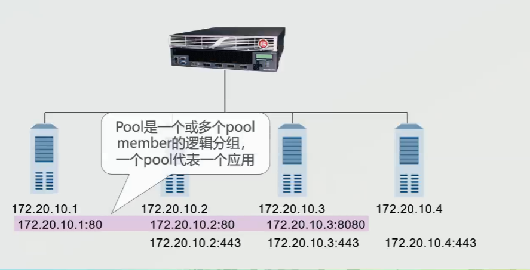
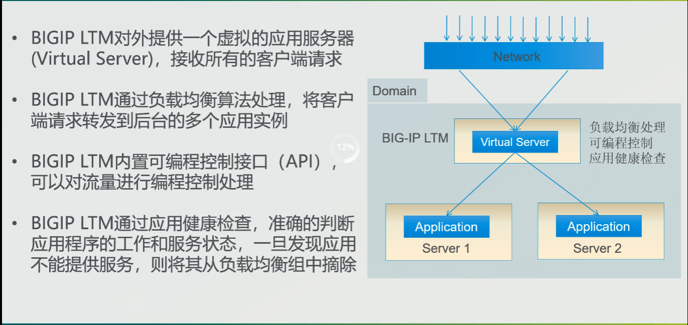
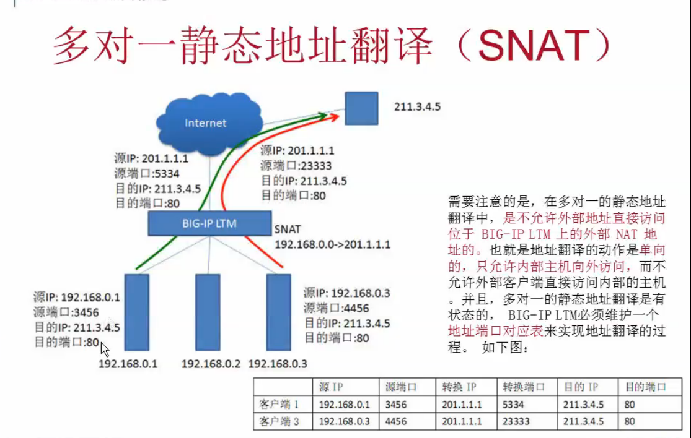
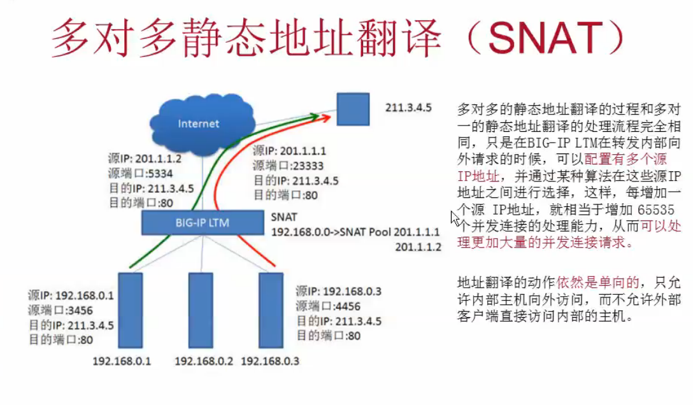

# F5

## 基本概念

- Node： Node是一个部署在内网的物理或逻辑服务器，一个节点表示一个IP;
- Pool： 一个或多个pool member的分组，一个节点可以存在与多个pool; pool中的member一般提供相同服务
 

- Pool member：是node上运行的一个服务，用IP地址和服务端口组合表示;
- Virsual Server： 由IP地址和端口组合而成用来监听客户端的请求，当客户流量过来时，会先访问VS，然后流向pool中
- Profiles：一个配置文件定义了一个vs进程如何对流量的处理方式，可以被关联一个或者多个vs 

 

- SNAT

 
 
