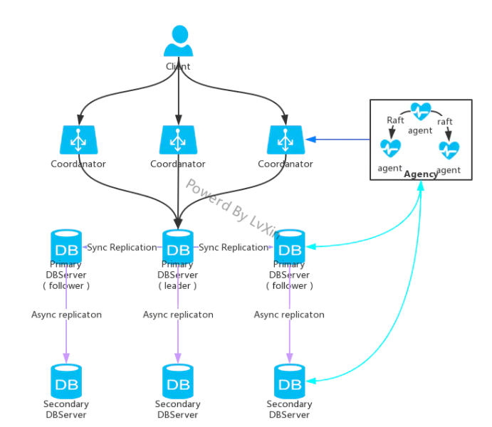

# arangodb
## 表类型
- Document 存储单个节点数据
- Edge 存储两个节点关系 

## 关系型数据库与ArangoDB的对应关系


## RocksDB 和 MMFiles


## aql

### 新增
语法 : INSERT document INTO collectionName

####eg
````
INSERT {
    "name": "Ned",
    "surname": "Stark",
    "alive": true,
    "age": 41,
    "traits": ["A","H","C","N","P"]
} INTO Characters

````

### 查询

语法 : FOR variableName IN collectionName

####eg

````

FOR c IN Characters
    RETURN c

````

#### 拓扑查询

eg

````

for i in DeviceModel
    filter i.name == "cisco3620"
    for vv,edge,path in 1..1 outbound i Bind 
    return path
    
    

````


### 修改

语法 : UPDATE documentKey WITH object IN collectionName

####eg

````

UPDATE "2861650" WITH { alive: false } IN Characters

````

#### 获得更新前后的值

````

FOR u IN user_lyw
    FILTER u.age == 40
    UPDATE u WITH { age: 20 } IN user_lyw
    RETURN { old: OLD, new: NEW }

````

#### 通过upsert判断是insert还是update

如果upsert执行插入操作，old则其值为null。如果执行的是更新或替换操作，old将在更新/替换之前包含文档的先前版本

````

UPSERT { name: 'superuser' } 
INSERT { name: 'superuser', logins: 1, dateCreated: DATE_NOW() } 
UPDATE { logins: OLD.logins + 1 } IN users 
RETURN { doc: NEW, type: OLD ? 'update' : 'insert' }

````

### 删除

####eg

````
REMOVE "2861650" IN Characters
````


## arangodb 集群

### 集群架构

- agent 
    - 是集群配置信息的存储中心，并为集群提供leader选取以及其它同步服务。（可以理解为Eureka集群）
- coordinator
    - 访问集群的请求必须通过此实例，协调集群任务，比如执行查询。知道数据的存储位置，并优化用户提交的查询。
- primary dbServer
    - 是实际托管数据的服务器。
- secondary dbServer
    - 使用异步复制的时候可以使用此实例



### 集群搭建

- master ：  arangodb --starter.data-dir=/usr/lyw/data（启动服务产生的文件存放的位置）
- slave1 ： arangodb --starter.data-dir=/usr/lyw/data --starter.join 192.168.170.131（关联的主节点）
- slave2 ： arangodb --starter.data-dir=/usr/lyw/data --starter.join 192.168.170.131（关联的主节点）

每个节点在启动后都会启动一个代理，数据服务器，协调器，注意以不同的命令启动节点之前，需要删除之前产生的文件或指定不同的启动目录！！

### 集群之间的同步复制

        arangodb的数据复制不限于数据库层面，而是直接作用于collection。在每个collection创建时，可以指定复制因子参数，这是其数据复制的主要参数。
    默认参数为1，意味着不进行数据复制。不同于Redis的主从集群方式，arangodb使用的是主主集群，客户端可以把请求发送到任何一个主节点，从不同节点
    看到的数据库视图都是一样的。（不同于负载均衡，并不是将请求负载到其中一个节点，而是在指定leader后，只操作leader的节点）
        假设collection1的复制因子设为1，在创建后，会选取一个primary dbServer作为leader，此后对该collection的请求都会落到leader上，但
    当leader宕机后，会导致针对于此collection的请求全部失效。
        假设collection2的复制因子为3，在创建后，会选取一个primary dbServer作为leader，两个作为follower。当然所有针对该collection的请求都
    会落到leader上，但写请求会经过写入leader，复制数据到follower两步，当所有follower的数据都复制后才会返回响应。如果说follower宕机，并不影响
    用户针对collection的请求，agent会将集群中其它的实例作为follower，直到达到复制因子的数值。如果实例不够，那么就会等待此实例复原，复原后会将
    leader副本的数据复制到该follower的副本中。如果说leader宕机，那么需要agent在follower中重新选取一个leader，其它的follower需要会自动与新的
    leader同步，当旧leader恢复后，如果follower没有达到复制因子上限，则变成follower实例。

### 集群之间的异步复制

        异步复制与同步复制不同，当请求落到dbServer上，会直接返回响应，异步将primary dbServer的数据复制到secondary dbServer中。这样会降低
    写请求的响应时间。但是问题是数据同步到secondary dbServer是需要延迟时间的，如果在这个延迟时间里，primary dbServer宕机，那么就会造成
    主备之间的数据不一致。


