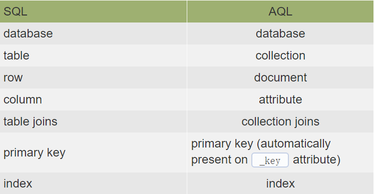

# arangodb
## 表类型
- Document 存储单个节点数据
- Edge 存储两个节点关系 

## 关系型数据库与ArangoDB的对应关系



## RocksDB 和 MMFiles


## aql

### 新增
语法 : INSERT document INTO collectionName

####eg
````
INSERT {
    "name": "Ned",
    "surname": "Stark",
    "alive": true,
    "age": 41,
    "traits": ["A","H","C","N","P"]
} INTO Characters

````

### 查询

语法 : FOR variableName IN collectionName

####eg

````

FOR c IN Characters
    RETURN c

````

#### 拓扑查询

eg

````

for i in DeviceModel
    filter i.name == "cisco3620"
    for vv,edge,path in 1..1 inbound i outbound Bind 
    return path
    
    

````


### 修改

语法 : UPDATE documentKey WITH object IN collectionName

####eg

````

UPDATE "2861650" WITH { alive: false } IN Characters

````

#### 获得更新前后的值

````

FOR u IN user_lyw
    FILTER u.age == 40
    UPDATE u WITH { age: 20 } IN user_lyw
    RETURN { old: OLD, new: NEW }

````

#### 通过upsert判断是insert还是update

如果upsert执行插入操作，old则其值为null。如果执行的是更新或替换操作，old将在更新/替换之前包含文档的先前版本

````

UPSERT { name: 'superuser' } 
INSERT { name: 'superuser', logins: 1, dateCreated: DATE_NOW() } 
UPDATE { logins: OLD.logins + 1 } IN users
RETURN { doc: NEW, type: OLD ? 'update' : 'insert' }

````

### 删除

####eg

````
REMOVE "2861650" IN Characters
````


