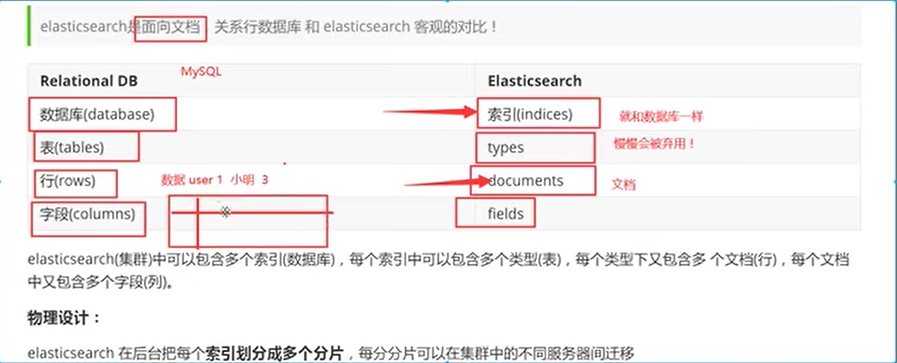
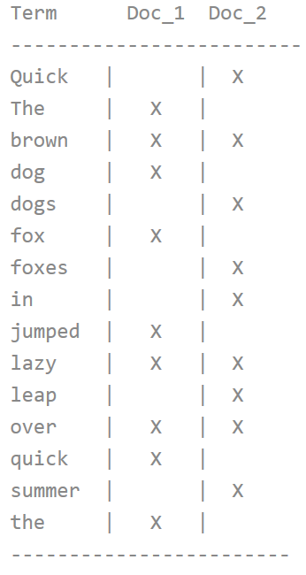

# elasticSearch

## 基本概念



ElasticSearch中的数据可以概括的分为两类：精确值和全文

- 精确值如它们听起来那样精确。例如日期或者用户ID，但字符串也可以表示精确值
- 全文是指文本数据，例如一个推文的内容


## 倒排索引

为创建倒排索引，首先将每个文档的content域拆分成单独的词，创建一个包含所有不重复词条的排序列表，然后列出每个词条出现在哪个文档。



之后进行搜索时，会判断传入值在倒排索引中的Score，具体来说就是传入值是否包含这些词，再查找包含这些词的文档，命中这些词最多的文档就是
匹配程度最高的结果


## SpringBoot集成ElasticSearch


### 导入依赖
````
      <dependency>
        <groupId>org.elasticsearch.client</groupId>
        <artifactId>elasticsearch-rest-high-level-client</artifactId>
        <version>${es.version}</version>
      </dependency>
      <dependency>
        <groupId>org.elasticsearch</groupId>
        <artifactId>elasticsearch</artifactId>
        <version>${es.version}</version>
      </dependency>
````

### 向容器里注入RestHighLevelClient对象

````
RestHighLevelClient client = new RestHighLevelClient(
        RestClient.builder(
                new HttpHost("localhost", 9200, "http"),
                new HttpHost("localhost", 9201, "http")));
````

### crud

- GetRequest
- UpdateRequest
- DeleteRequest
- CreateRequest
- BulkRequest 实现批量操作
- SearchRequest 实现高级查询
