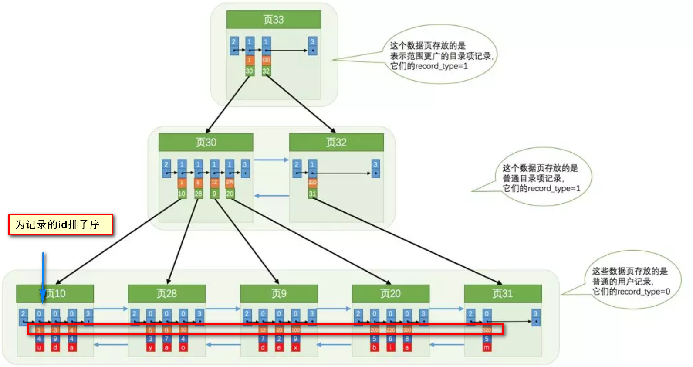

## mysql数据库

### 如何优化limit

利用表的覆盖索引来加速分页查询

我们都知道，利用了索引查询的语句中如果只包含了那个索引列（覆盖索引），那么这种情况会查询很快。

SELECT * FROM product WHERE ID > =(select id from product limit 866613, 1) limit 20

### 三范式

- 第一范式 属性不可分
- 第二范式 非主属性必须依赖于键码
- 第三范式 非主属性不能传递函数依赖

### 存储引擎

#### Innodb和MyISam的区别

- 事务：InnoDB 是事务型的，可以使用 Commit 和 Rollback 语句。

- 并发：MyISAM 只支持表级锁，而 InnoDB 还支持行级锁。

- 外键：InnoDB 支持外键。

- 备份：InnoDB 支持在线热备份。

- 崩溃恢复：MyISAM 崩溃后发生损坏的概率比 InnoDB 高很多，而且恢复的速度也更慢。

- 其它特性：MyISAM 支持压缩表和空间数据索引。

### 联表查询

1. 内连接

select * from info_data,info_type where info_data.tid = info_type.id;

select * from info_data as d inner join info_type as t on d.tid = t.id;

2. 左外连接

select * from info_data as d left outer join info_type as t on d.tid = t.id;

显示 左表所有记录 （d） , 右表只显示符合条件的记录 ， 不符合的为null

3. 右外连接

select * from info_data as d right outer join info_type as t on d.tid = t.id;

显示 右表所有记录 （t） , 左表只显示符合条件的记录 ， 不符合的为null

### 索引 （InnoDB）

#### 索引如何提高查询效率

首先，InnoDB本身支持两种索引，B+索引和哈希索引。那么，我们就来看一下B+索引，B+索引，实际上运用的就是B+树这样的数据结构

下面，以上述这张图来做解释，我们知道，mysql的基本存储结构是页，一个页有16kb，在上图中，最下方一行的页都属于数据页，里面存储的都是用户记录，其他的
页都属于索引页，里面存储的是主键与数据页或是下一级索引页的指针，这样便可以通过主键定位到数据页或是下一级的索引页。

从树的角度来看，数据页都是叶子结点，我们查询数据时，如果没有索引页，就需要在数据页这个双向链表中全查询。这样显得十分耗时。当有了索引页后，我们便可以
通过索引页上主键和数据页的对应关系来确定数据页的位置，进而快速查询数据。

那么索引页和数据页是如何产生的？数据页存放数据，当一个数据页存放不下新增的数据后，便会新产生一个数据页。索引页也是如此，当索引页存放不下新增的
主键和下一级页的对应关系后，便会新产生一个索引页，而当同级的索引页出现两个及以上时，便会在其上级产生一个维护此级的索引页。

#### 索引会降低增删改的效率

如果不使用索引，那么数据页的数据结构便是一个双向链表，而链表最擅长的便是增删。而加上索引之后，页的结构变成B+树，B+树本身属于一种平衡树，对树的增删
当然不如对链表的增删。

#### 聚集索引和非聚集索引

简要概括：
- 聚集索引就是以主键创建的索引
- 非聚集索引就是以非主键创建的索引

区别：

- 聚集索引在叶子节点存储的是表中的数据
- 非聚集索引在叶子节点存储的是主键和索引列
- 使用非聚集索引查询出数据时，拿到叶子上的主键再去查到想要查找的数据。(拿到主键再查找这个过程叫做回表)

一种特殊的索引叫做覆盖索引，它特殊在并不需要回表这个过程。回表其实就是去主键生成的B+树拿到想要的数据，但是如果想要的数据已经存在在原本的B+树上
，那么就并不需要回表

#### 索引最左匹配原则

- 索引可以简单如一个列(a)，也可以复杂如多个列(a, b, c, d)，即联合索引。
- 如果是联合索引，那么key也由多个列组成，同时，索引只能用于查找key是否存在（相等），遇到范围查询(>、<、between、like左匹配)等就不能进一步匹配了，后续退化为线性查找。
- 因此，列的排列顺序决定了可命中索引的列数。

例子：

- 如有索引(a, b, c, d)，查询条件a = 1 and b = 2 and c > 3 and d = 4，则会在每个节点依次命中a、b、c，无法命中d。

#### 索引类型

- 普通索引 最基础的索引 没有任何限制

- 唯一索引 索引的值必须唯一

- 主键索引 InnoDB默认会创建

- 组合索引 多个字段联合形成的索引，遵循最左匹配原则

- 全文索引 主要用来查找文本中的关键字，而不是直接与索引中的值相比较。fulltext索引跟其它索引大不相同，它更像是一个搜索引擎，而不是简单的where语句的参数匹配。fulltext索引配合match against操作使用，而不是一般的where语句加like。它可以在create table，alter table ，create index使用，不过目前只有char、varchar，text 列上可以创建全文索引。

##InnoDB的行锁模式及加锁方法

InnoDB实现了以下两种类型的行锁。
- 共享锁（s）：又称读锁。允许一个事务去读一行，阻止其他事务获得相同数据集的排他锁。若事务T对数据对象A加上S锁，则事务T可以读A但不能修改A，其他事务只能再对A加S锁，而不能加X锁，直到T释放A上的S锁。这保证了其他事务可以读A，但在T释放A上的S锁之前不能对A做任何修改。
- 排他锁（Ｘ）：又称写锁。允许获取排他锁的事务更新数据，阻止其他事务取得相同的数据集共享读锁和排他写锁。若事务T对数据对象A加上X锁，事务T可以读A也可以修改A，其他事务不能再对A加任何锁，直到T释放A上的锁。

对于共享锁大家可能很好理解，就是多个事务只能读数据不能改数据。
 
对于排他锁大家的理解可能就有些差别，我当初就犯了一个错误，以为排他锁锁住一行数据后，其他事务就不能读取和修改该行数据，其实不是这样的。排他锁指的是一个事务在一行数据加上排他锁后，其他事务不能再在其上加其他的锁。mysql InnoDB引擎默认的修改数据语句：update,delete,insert都会自动给涉及到的数据加上排他锁，select语句默认不会加任何锁类型，如果加排他锁可以使用select …for update语句，加共享锁可以使用select … lock in share mode语句。所以加过排他锁的数据行在其他事务种是不能修改数据的，也不能通过for update和lock in share mode锁的方式查询数据，但可以直接通过select …from…查询数据，因为普通查询没有任何锁机制。

### 意向锁
使用意向锁（Intention Locks）可以更容易地支持多粒度封锁。

在存在行级锁和表级锁的情况下，事务 T 想要对表 A 加 X 锁，就需要先检测是否有其它事务对表 A 或者表 A 中的任意一行加了锁，那么就需要对表 A 的每一行都检测一次，这是非常耗时的。

意向锁在原来的 X/S 锁之上引入了 IX/IS，IX/IS 都是表锁，用来表示一个事务想要在表中的某个数据行上加 X 锁或 S 锁。有以下两个规定：

- 一个事务在获得某个数据行对象的 S 锁之前，必须先获得表的 IS 锁或者更强的锁；
- 一个事务在获得某个数据行对象的 X 锁之前，必须先获得表的 IX 锁。

### 封锁协议

#### 一级封锁协议

事务 T 要修改数据 A 时必须加 X 锁，直到 T 结束才释放锁。

可以解决丢失修改问题，因为不能同时有两个事务对同一个数据进行修改，那么事务的修改就不会被覆盖

#### 二级封锁协议

在一级的基础上，要求读取数据 A 时必须加 S 锁，读取完马上释放 S 锁。

可以解决读脏数据问题，因为如果一个事务在对数据 A 进行修改，根据 1 级封锁协议，会加 X 锁，那么就不能再加 S 锁了，也就是不会读入数据。

#### 三级封锁协议

在二级的基础上，要求读取数据 A 时必须加 S 锁，直到事务结束了才能释放 S 锁。

可以解决不可重复读的问题，因为读 A 时，其它事务不能对 A 加 X 锁，从而避免了在读的期间数据发生改变。

### MVCC(多版本并发控制)

加锁能解决多个事务同时执行时出现的并发一致性问题。在实际场景中读操作往往多于写操作，因此又引入了读写锁来避免不必要的加锁操作，例如读和读没有互斥关系。读写锁中读和写操作仍然是互斥的，而 MVCC 利用了多版本的思想，写操作更新最新的版本快照，而读操作去读旧版本快照，没有互斥关系，这一点和 CopyOnWrite 类似。

在 MVCC 中事务的修改操作（DELETE、INSERT、UPDATE）会为数据行新增一个版本快照。

脏读和不可重复读最根本的原因是事务读取到其它事务未提交的修改。在事务进行读取操作时，为了解决脏读和不可重复读问题，MVCC 规定只能读取已经提交的快照。当然一个事务可以读取自身未提交的快照，这不算是脏读