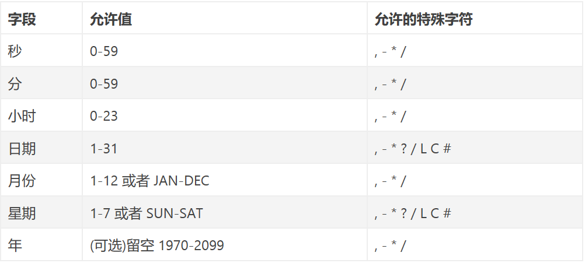
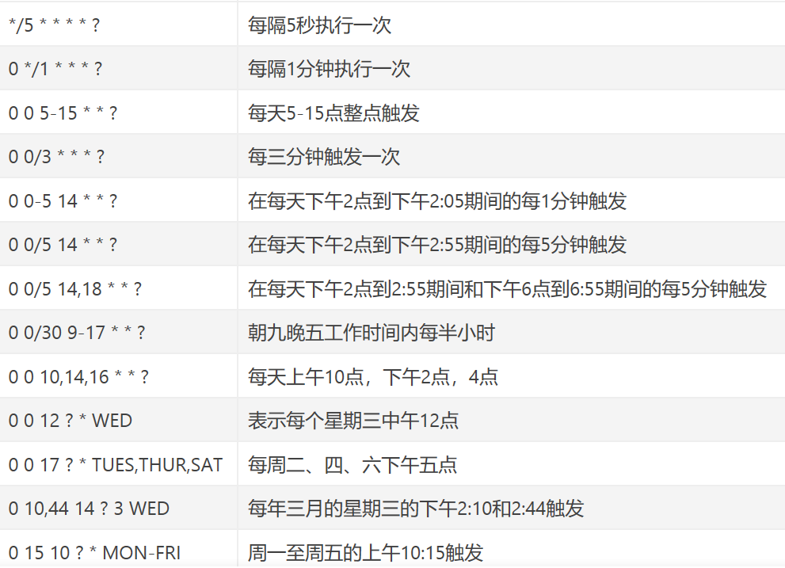

# 定时器 Quartz

    定时器主要应用与定时处理任务，类似于Java中的定时任务线程池，只不过Quartz的功能更为强大，且在各个方面封装的十分优秀。
    通过专门的cron表达式来描述任务的执行周期，cron表达式规则如下图所示

 

## 三大概念

- Job
- Trigger(触发器)
- Scheduler

## cron表达式示例

## SpringBoot集成Quartz

- 导入spring-boot-starter-quartz依赖
- 注入ScheduleFactoryBean 
- 通过ScheduleFactoryBean操作定时任务

