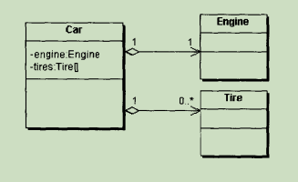

##学习笔记

如何做到支持可维护性的复用？

### UML

类图中各类与类之间的关系

- 一般化关系 表示类与类之间继承或实现的关系 是从子类指向父类的

     
     
- 关联关系 表示类与类之间的连接，他使一个类知道另一个类的属性和方法

    
    
- 聚合关系 同样也表示类与类之间的连接，不过与关联不同的是，聚合的两个类并不在同一个层次上，一个代表整体，一个代表部分
    
    
    
- 合成关系 也表示类与类之间的连接，不过关联性比聚合更强，表现在负责整体的类要控制代表部分的类的生命周期。

    
    
- 依赖关系 表示一个类依赖于另一个类的定义，与关联关系不同的是，依赖关系的两个类里并不需要定义另一个类的属性，而是在方法中传入

    

### 设计原则

- 开闭原则（ocp) ： 对扩展开放，对修改关闭。 实现的关键在于抽象化
- 里氏替换原则 ： 任何基类出现的地方，都可以用子类来替换
- 依赖倒转原则 ： 要依赖于抽象 而不是依赖于实现
- 接口隔离原则 ： 要尽可能提供较小的接口，而不是提供大的接口
- 合成/聚合复用原则 ： 要尽量使用合成/聚合复用代码，而不使用继承
- 迪米特原则 : 一个对象应对另一个对象有尽可能少的了解 这里理解为 MVC架构中不会跨层引用,控制层只会引用业务层,而不会引用持久层，
也可以通过工厂模式来理解此原则，把具体实现细节写在工厂方法中，只暴露工厂给使用者，是系统内部耦合度降低

#### 依赖倒转原则

 一. 类与类之间三种依赖关系
 
 1.零耦合关系，类与类之间没有任何关联
 
 2.具体耦合关系，由一个类对另一个具体类的直接引用造成
 
 3.抽象耦合关系，由一个类对另一个抽象类（或接口）的引用，可以是关联，也可以是依赖
 
 二. 针对接口编程指的是要在接口和实现类中实现对变量，参量等的声明。也就是说，在具体实现类中，应只有对接口和抽象类的实现方法，而不应该包含其他方法。
 可以发现的是，java在创建对象时，并不满足依赖倒转原则，因为必须要显示声明创建对象的类型。正因为如此，出现了工厂等设计模式

#### 迪米特原则

 一. 将迪米特原则应用到系统中应注意一下几点
 
 1.在类的划分上，应尽量设计弱耦合的类
 
 2.在类的结构设计上，每一个类都应该降低成员的访问权限
 
 3.只要有可能，应尽量将类设计成不变类（对象的内部状态无法改变，没有属性赋值方法）
 
 4.对其他类引用时，应将对对象的引用降到最低

### 接口

#### 接口对可插入性的保证

### 抽象类

设计类结构时应尽量保证所有的继承都是从抽象类开始的，而所有的具体类都没有子类

#### 设计理念
应尽量将公共代码抽取到上层

应尽量将数据移动到下层

#### 何时使用继承复用

- 如果两个类之间是“is a”关系，那么就使用继承。如果两个类之间是“has a”关系，则使用聚合关系描述。is a关系是指子类是超类的一种特殊种类，比如金丝猴和猴子。
has a关系是指子类是超类的一种角色，比如爬树和猴子

- 永远不要出现需要将一个子类换成另一个类的子类的情况。

- 子类应该具有扩展超类的责任，而不是去覆盖或者注销掉方法

- 不要继承工具类

## 创建模式

### 简单工厂模式

定义：由一个工厂类根据传入的参量决定创建出哪一种产品类的实例

### 工厂方法模式

定义：定义一个创建产品对象的工厂接口，将创建实际工作推迟到子类中

 一. 简单工厂模式的缺点

 对开-闭原则的支持不够，在新增产品对象时，虽然客户端不需要做出改变，但却需要在工厂对象中增加代码
 
 
### 单例模式

- 懒汉
- 饿汉
- 双重检验锁 （Java语言不成立）
- 静态内部类
- 枚举

#### 谈谈Java语言为何不支持双重检验锁，以及如何使用对该模式进行改进

    之所以Java语言不支持双重检验锁模式，是因为JVM中的优化操作（指令重排序）造成的。对象在进行new操作时，JVM会进行三个操作.
    1.为对象申请内存
    2.调用构造方法初始化对象
    3.将对象引用指向申请的内存
    由于指令重排序，导致2，3步骤顺序颠倒，在单线程情况下并不会出现问题。但是在双重检验锁这样的场景下，会导致方法返回对象引用有值但对象还未初始化完成的情况
 
    为解决这个问题，可以使用volatile来禁止指令的重排序

### 建造模式

    建造模式实际上是将一个对象的性质建造过程外部化到独立的建造者对象中，并通过一个导演者角色对这些外部化的性质赋值过程进行协调

#### 使用场景

- 需要生成的产品对象有复杂的内部结构。每一个内部成分本身可以是对象，也可以仅仅是产品对象的一个组成成分
- 需要生成的产品对象的属性相互依赖。建造模式可以强制实行一种分步骤进行的建造过程，因此，如果产品对象的一个属性必须在另一个属性被复制之后
才可以被赋值，使用建造模式便是一个很好的设计思想
- 在对象建造过程中会使用到系统中的其他一些对象，这些对象在产品对象的创建过程中不易得到。

#### 达到的效果

- 建造模式的使用使得产品的内部表象可以独立的变化。使用建造模式可以使客户端不必知道产品内部组成的细节
- 每一个Builder都相对独立，而与其他的Builder无关
- 模式所建造的最终产品更易于控制

## 适配器模式

类的适配器模式是把适配的类的API转换成为目标类的API

