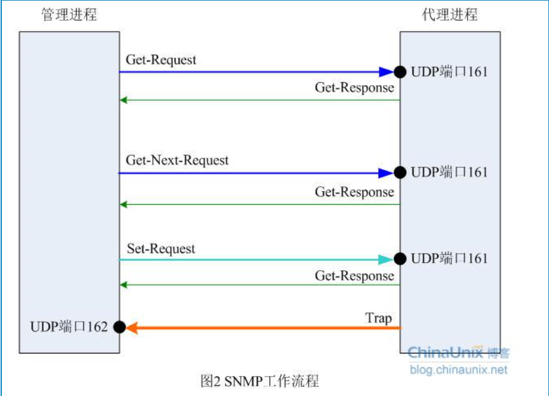

# SNMP

- 管理信息库（MIB）
- 管理信息结构（SMI）
- SNMP报文协议

## MIB

        任何一个被管理的资源都表示成一个对象，称之被管理的对象。MIB是被管理对象的集合。它定义了被管理对象的一系列属性：
    对象的名称，对象的访问权限和对象额数据类型等。每个SNMP设别（Agent）都有自己的MIB。MIB也可以看作是NMS（网络管理系统
    ，网络管理系统既可以指一台专门用来进行网络管理的服务器，也可以指某个网络设备中执行管理功能的一个应用程序）和Agent之间的
    沟通桥梁。
    
## SMI

    定义了SNMP框架所有信息的组织，组成和标识，它还为描述MIB对象和描述协议怎样交换信息奠定了基础。
    
## SNMP报文

- Get-Request SNMP管理站用此消息从拥有SNMP代理的网络设备中检索信息
- Get-Response SNMP代理则用Get-Response消息响应。
- Get-Next-Request 用于和Get-Request组合起来查询特定的表对象中的列元素。
- Set-Request SNMP管理站用Set-Request可以对网络设备进行远程配置（包括设备名，设备属性，删除设备或使某一个设备属性有效/
无效等）
- Trap SNMP代理使用Trap向SNMP管理站发送非请求消息，一般用于描述某一事件的发生，如接口up/down，ip地址修改等。

## OID(Object Identifier)
        每个管理对象都有自己的OID，管理对象通过树状结构进行组织，OID由树上的一系列整数组成，整数之间用.分隔开，树的叶子节点才是
    真正能够被管理的对象。

## walk and get

    一、snmpwalk和snmpget的区别：
    snmpwalk是对OID值的遍历（比如某个OID值下面有N个节点，则依次遍历出这N个节点的值。如果对某个叶子节点的OID值做walk，则取得到数据就不正确了，因为它会认为该节点是某些节点的父节点，而对其进行遍历，而实际上该节点已经没有子节点了，那么它会取出与该叶子节点平级的下一个叶子节点的值，而不是当前请求的节子节点的值。）
    snmpget是取具体的OID的值。（适用于OID值是一个叶子节点的情况）

## 思科路由器打开SNMP协议

    snmp-server community [凭证] ro/wo/rw
    snmp-server enable traps //打开SNMP协议

## 华三交换机打开SNMP协议

    snmp-agent sys-info version v1
    Snmp-agent sys-info version v2c
    Snmp-agent sys-info version v3
    Snmp-agent sys-info version all
    
    snmp-agent community {read/write} community-name [[mib-view view-name] /[acl acl-number]]

