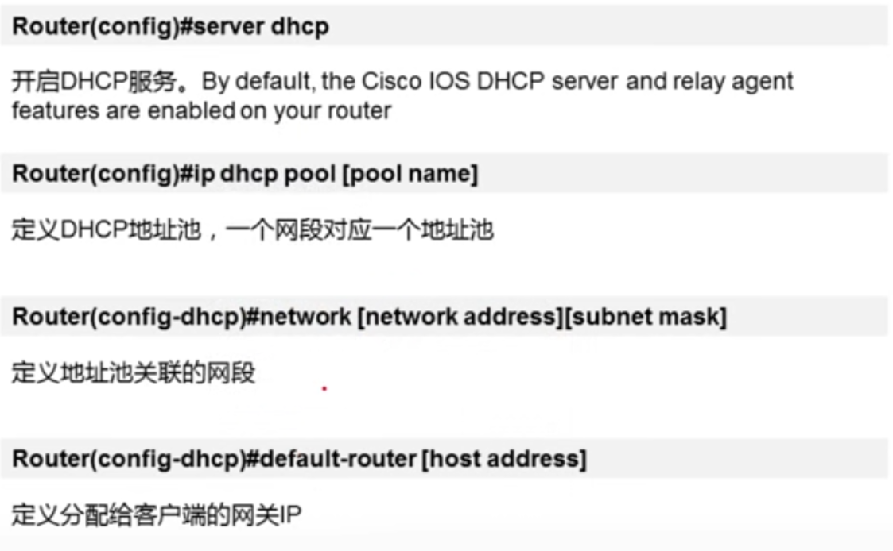

# 路由交换

## ipv4路由协议

- EIGRP - 增强型内部网关路由协议
- OSPF - 开放最短路径优先
- IS-IS - 中间系统到中间系统
- RIP - 路由信息协议

## ipv6路由协议

- RIPng（RIP 下一代） 
- OSPFv3
- Ipv6 的 EIGRP

## 静态路由

````

ip route [目标网络] [下一跳/出口]

````

！！注意 通信是双向的，因此要注意往返流量 也就是要配置双向的静态路由

### 默认静态路由

````
ip route 0.0.0.0 0.0.0.0 [下一跳/出口]

````

## 动态路由

### 内部网关协议

- 距离矢量协议
    - RIPv1
    - RIPv2
    - IGRP
    - EIGRP
- 链路状态协议
    - OSPF
    - IS-IS

#### 距离矢量协议

一台路由器，当它从两种不同的动态路由选择协议中，学习到去往同一个目的地的路由，比较AD(管理距离，见下图)值
，取值小的，将路由装入路由表，进行数据转发；另一条路径，只有当优选的路径DOWN掉的时候，
才会出现和使用。


一台路由器，当它从同种动态路由协议但不从方向(邻居)学习 去往同一个地的路由，则比较
mertric度量值，选择优的，装入路由表，进行数据转发使用。

##### RIP协议

- 适用于小型同类网络
- 基于UDP，端口520的应用层协议
- RIP以跳数作为mertric值
- RIP会造成环路 解决方法有设置最大跳数（16跳），水平分割，触发更新等
 


### 外部网关协议

- BGP 


## ACL

ACL 是一系列 IOS 命令，根据数据包报头中找到的信息来控制路由器应该转发还是应该丢弃数据包。

- 限制网络流量以提高网络性能。例如，如果公司政策不允许在网络中传输视频流量，那么就应该配置和应用 ACL 以阻止视频流量。这可以显著降低网络负载并提高网络性能。
- 提供流量控制。ACL 可以限制路由更新的传输，从而确保更新都来自一个已知的来源。
- 提供基本的网络访问安全性。ACL 可以允许一台主机访问部分网络，同时阻止其他主机访问同一区域。例如，“人力资源”网络仅限授权用户进行访问。
- 根据流量类型过滤流量。 例如，ACL 可以允许邮件流量，但阻止所有 Telnet 流量。
- 屏蔽主机以允许或拒绝对网络服务的访问。ACL 可以允许或拒绝用户访问特定文件类型，例如 FTP 或 HTTP。 


### 扩展访问控制列表

针对一种协议，在路由器的一个方向上只能有一个acl

````
access-list access-list-number {permit|deny} 协议 源地址 通配符 目标地址 通配符 
````

### 通配符

0表示严格匹配，1表示任意 eg：192.168.1.1 0.0.0.255 表示前24位匹配，后8位随意 范围 192.168.1.1~192.168.1.254

通配符掩码计算方法：从255.255.255.255中减去子网掩码


## DHCP


 


## 交换机

- 接入层 用户接入，接入安全，访问控制
- 汇聚层 流量汇聚，链路冗余，设备冗余，路由选择
- 核心层 高速转发，服务器接入，路由选择
- 出口层 广域网接入，出口策略，带宽控制

### VLAN

- 一个VLAN中所有设备都是在同一广播域内；广播不能跨越VLAN传播
- 一个VLAN为一个逻辑子网；由被配置为此VLAN成员的设备组成，不同VLAN间需通过路由器实现相互通信
- VLAN中成员多基于Switch端口号码，划分VLAN就是对Switch接口划分
- VLAN工作与OSI参考模型的第二层


### Trunk


- 当一条链路，需要承载多VLAN信息的时候，需要使用trunk实现
- 一般见于交换机之间或交换机与路由之间 


